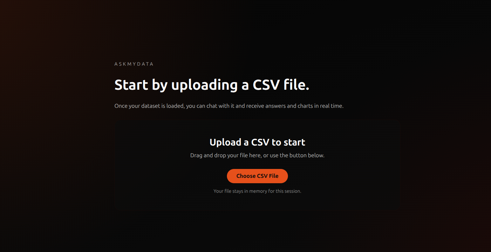
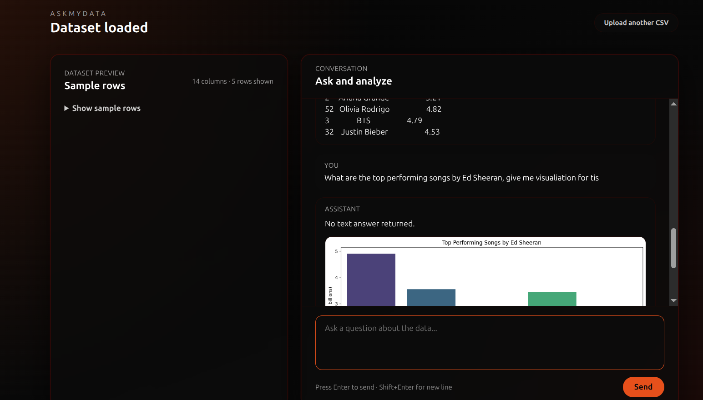

# AskMyData

**Talk to your data, not about it.**

Upload any CSV and ask questions in plain English. AskMyData generates and executes Python code behind the scenes to analyze your data and return answers as text or charts.




---

## Why I Built This

Built to understand how agentic AI works in practice specifically the pattern of LLM-generated code being executed at runtime. Rather than building another chatbot that just returns text, I wanted to wire together a pipeline where GPT actually *does* something: writes Python, runs it, and recovers from its own errors. The result is a tool that lets anyone ask questions about a CSV dataset and get back real answers and charts without writing a single line of code.

---

## Features

- Upload any CSV and get an instant data preview
- Ask questions in plain English and get accurate answers
- Auto-generates and executes Python (pandas + matplotlib) to answer each question
- Returns text answers and rendered charts in the same conversation
- Self-correcting pipeline if generated code fails, it automatically retries with the error as context
- Sandboxed code execution generated code runs in a restricted environment with no access to the file system or network
- Strict dataset scope questions unrelated to the uploaded data are refused cleanly

---

## How It Works

```
1. User uploads a CSV
         ↓
2. Backend loads it into a pandas DataFrame
   and extracts column names, dtypes, and a 5-row preview
         ↓
3. User asks a plain English question
         ↓
4. Column schema + preview + question are sent to gpt-4o-mini
         ↓
5. GPT returns executable Python code using df, pd, plt, sns
         ↓
6. Code is validated for syntax, then executed in a restricted sandbox
   (no builtins, no os, no subprocess — only pandas, matplotlib, seaborn, and the DataFrame)
         ↓
7. If execution fails → error + original code sent back to GPT for a single self-correcting retry
         ↓
8. Text output (stdout) and/or chart (base64 PNG) returned to frontend
         ↓
9. Answer and chart rendered in the conversation UI
```

---

## Tech Stack

### Backend
- **FastAPI** — REST API server
- **pandas** — data loading and manipulation
- **matplotlib / seaborn** — chart generation
- **OpenAI API** — `gpt-4o-mini` for code generation
- **exec() with restricted globals** — sandboxed code execution
- **python-dotenv** — environment variable management

### Frontend
- **Next.js** (App Router) with **TypeScript**
- **Tailwind CSS** — styling

---

## Quick Start

### 1. Clone the repo

```bash
git clone https://github.com/your-username/askmydata.git
cd askmydata
```

### 2. Backend

```bash
python -m venv .venv
source .venv/bin/activate        # Windows: .venv\Scripts\activate
pip install -r backend/requirements.txt
cp backend/.env.example backend/.env
# Add your OpenAI API key to backend/.env
uvicorn backend.main:app --reload
```

### 3. Frontend

```bash
cd frontend
npm install
npm run dev
```

Visit `http://localhost:3000`

---

## Environment Variables

**backend/.env**
```
OPENAI_API_KEY=your_openai_api_key_here
ALLOWED_ORIGINS=http://localhost:3000
```

**frontend/.env.local**
```
NEXT_PUBLIC_API_BASE=http://localhost:8000
```

---

## APIs

| Method | Endpoint | Description |
|--------|----------|-------------|
| `POST` | `/upload` | Upload a CSV file. Returns `session_id`, columns, dtypes, and a 5-row preview. |
| `POST` | `/analyze` | Send a `session_id` and a question. Returns a text answer and/or a base64 chart. |
| `GET`  | `/health` | Basic health check. |

### POST /upload

**Response**
```json
{
  "session_id": "b3f1c2a4-...",
  "columns": ["artist", "track", "streams"],
  "dtypes": { "artist": "object", "streams": "int64" },
  "preview": [["Drake", "God's Plan", 2100000000]]
}
```

### POST /analyze

**Request**
```json
{
  "session_id": "b3f1c2a4-...",
  "question": "Who has the most streamed song?"
}
```

**Response**
```json
{
  "answer": "The most streamed song is God's Plan by Drake with 2,100,000,000 streams.",
  "chart": null
}
```

---

## Security

Code execution is sandboxed using restricted globals:

```python
restricted_globals = {
    "__builtins__": {},   # all Python builtins removed
    "pd": pd,
    "plt": plt,
    "sns": sns,
    "df": dataframe,
    "print": print,
}
```

Generated code cannot access `os`, `subprocess`, `open`, or make any network calls. Before execution, code is validated with `compile()` to catch syntax errors without running anything.

---


## Roadmap

- Streaming responses in the UI
- Multi-file / multi-sheet support
- Natural language chart customization
- Export answers and charts as a report
- E2B sandbox for production-safe deployment

---

## Data Handling

- Uploaded CSVs are processed in memory and never written to disk
- DataFrames are stored server-side in an in-memory dictionary for the duration of the session
- No data is sent to any third party except the column schema and a 5-row preview to the OpenAI API for code generation
